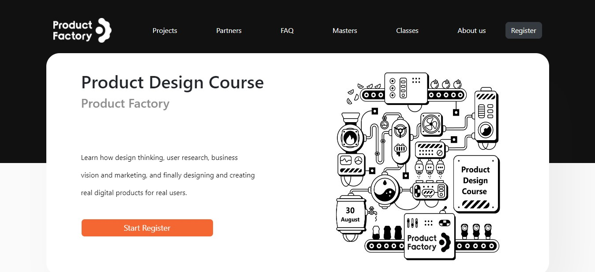
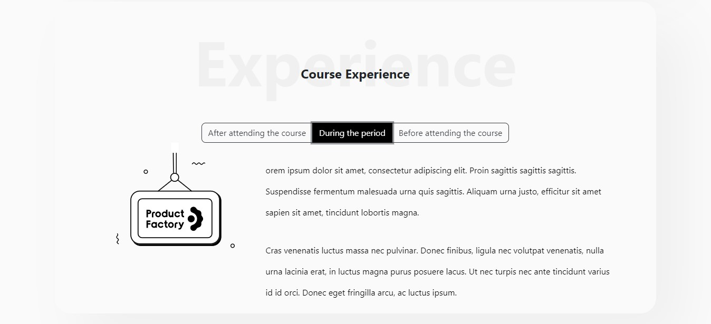
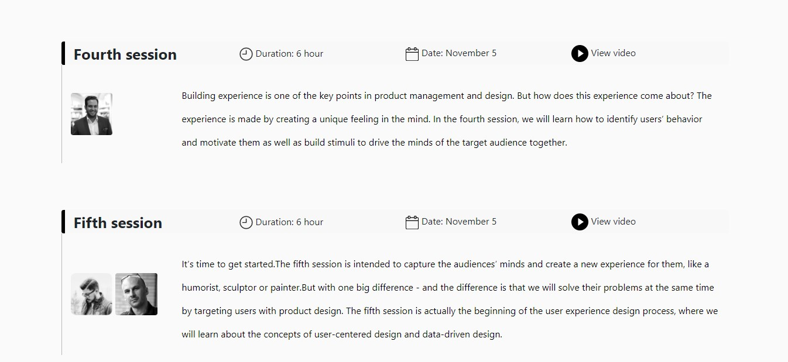

# product-factory-test

<strong>Product Factory</strong> foi um desafio de criação de layout, recebi o desenho no adobe XD com o desafio de criar o layout mais fiel possível ao projeto.

Para a criação do layout responsivo utilizei o Bootstrap na versão 4 e conceitos de design Flex Box. O layout é 100% responsivo, foi pensado para diversos tamanhos de telas.
Para interações do usuário com a interface utilizei Javascript em sua forma mais pura.

<figure>
  
  <figcaption>Slider da página inicial.</figcaption>
</figure>

<figure>
  
</figure>

<figure>
  
</figure>

<a href="https://product-factory.vercel.app/" target="_blank">Clique aqui para acessar o site</a>
